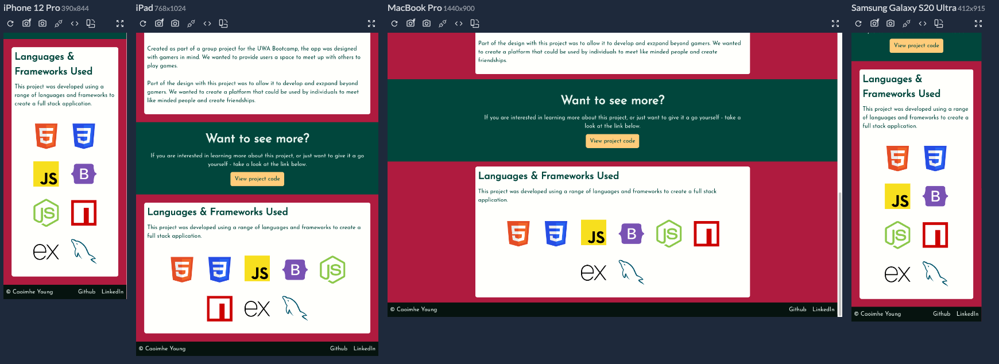

# Caoimhe Young HTML & CSS Portfolio

## https://caoimhejyoti.github.io/caoimheyoung/

   

---

[About](#about) ✦ [Wireframe](#wireframe) ✦ [Responsiveness](#responsiveness) ✦ [Future Developments](#future-developments) ✦ [Resources](#resources) ✦ [License](#license) ✦ [Contact](#contact)

---

## About

Personal Portfolio - created as part of She Codes Australia Plus Program, October 2023.

Version 1 created with purely HTML and CSS - October 2023.

## Wireframe

Original wireframe available [here](https://caoimhejyoti.github.io/caoimheyoung/assets/images/readme/portfolio_wireframe.pdf).

## Responsiveness

This portfolio is fully responsive to various device sizes.
To display this, I have used the Responsivley App to demonstrate several devices at once. The devices i am deomstrating are:

- iPhone12 (390x844px)
- iPad (768x1024px)
- MacBookPro (1440x900px)
- Samsung Galaxy S20 Ultra (412x915px)

Further details of this app can be found in [Resources](#resources).

### Main Page

This image shows the "Hero" section of the main portfolio page.

This image shows the "Who is Caoimhe" section of the main portfolio page.

This image shows the "Languages and Frameworks Used" section of the main portfolio page.

This image shows the "Previous Projects" section of the main portfolio page.

This image shows the "Contact"section of the main portfolio page.

### Out and About Project Page

This image shows the "Hero" section of the Out and About Project page.

This image shows the "Project Overview" section of the Out and About Project page.

This image shows the "Languages and Frameworks used" section of the Out and About Project page. The languages are expanded and visible in this image.

This image shows the "Languages and Frameworks used" section of the Out and About Project page. The languages are condensed in this image.

### Buddy Up Project Page

This image shows the "Hero" section of the Buddy Up Project page.

This image shows the Project Overview and "Want to know more?" section of the Buddy Up Project page.

This image shows the "Languages and Frameworks used" section of the Buddy Up Project page.

## Future Developments

As I progress in my coding career, I will bring my projects to this proposal.

In terms of the development of this site, I would like to continue to work with accessibility as a high priority.

While creating this site, I focused on the colour contrast, font sizes and ensuring alt text has been provided for all elements that require them.

Key accessibility things that need I would like to resolve can be see below. I hope to gradually tick them off.

1. Focus, Active and Hover CSS for my menus when on a small device.
2. Look further into aria attributes and work with these as appropriate.
3. Look at adding an expandable container for users to chose whether they want to see every language I have worked with.

I am still learning about accessible design so I welcome all feedback. If you have experienced any access restrictions, please let me know and I will work to reduce these in the future.

## Resources

https://webaim.org/resources/contrastchecker/

https://typescale.com/

http://colormind.io/bootstrap/

https://responsively.app/

## License

This project is using the following license:

**MIT**

For further information regarding the license, please follow the link below:
https://opensource.org/licenses/MIT

---

## Contact

If you have any further questions, please contact via email or github.

 
